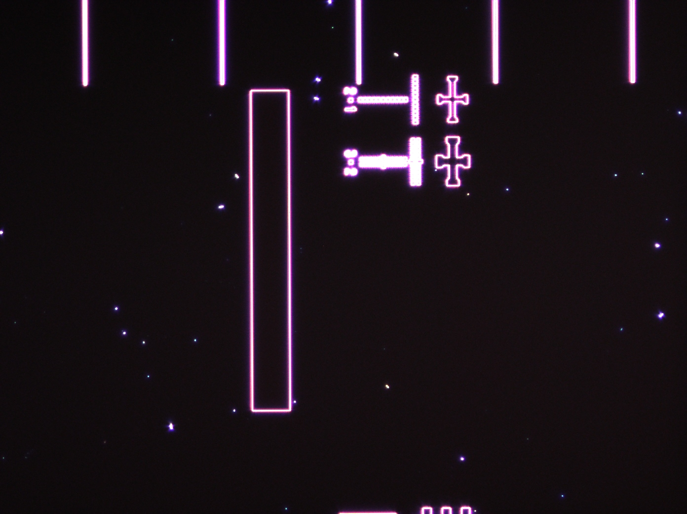
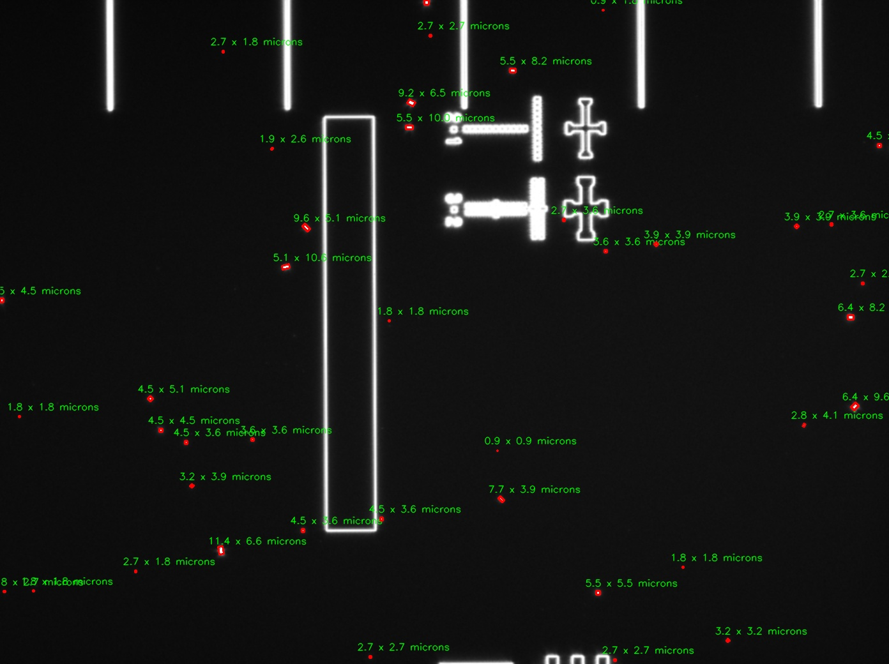

# Fab-Process-Dark-Field-Particle-Counter
This Python program is designed to automate the counting of particles in dark field microscope images.

### Overview
In dark field microscopy, identifying and quantifying particles that are not features on the wafer can be challenging. This tool leverages computer vision techniques to streamline this process. Given a dark field image, the program:

1. Identifies particles that are not wafer features.
2. Counts the number of these particles.
3. Provides a summary of statistics based on the measurements.

## Features
 * Automated Particle Detection: Utilizes OpenCV to detect and count particles.
 * Summary Statistics: Generates statistics on the identified particles.

## Requirements
  * Python 3.x
  * OpenCV
  * NumPy

## Usage
1. Place your dark field microscope image in the designated folder.
2. Run the main script:
```{python} 
	python particle_counter.py --image path_to_image
```
3. The python program will output a marked image and the generated summary statistics

## Example
To run the program with a test image located in the /images folder, use the following command:

```{python} 
	python particle_counter.py --image /images/example.jpg
```
The program takes the input image:

 

And produces an output with particles of interest marked:

 

The program will also output the following statistics:

* Total number of particles: 41
* Average particle size: 21.1 µm²
* Sample standard deviation: 19.61 µm²

## License
This project is licensed under the MIT License - see the LICENSE file for details.
